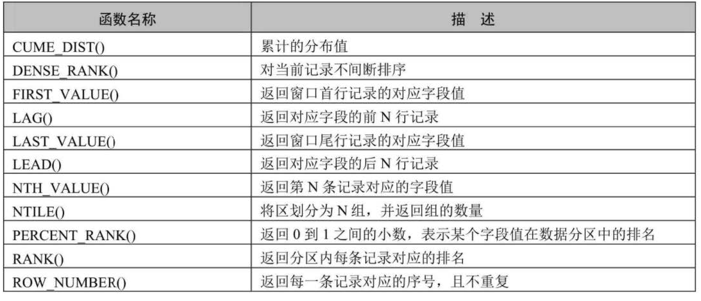
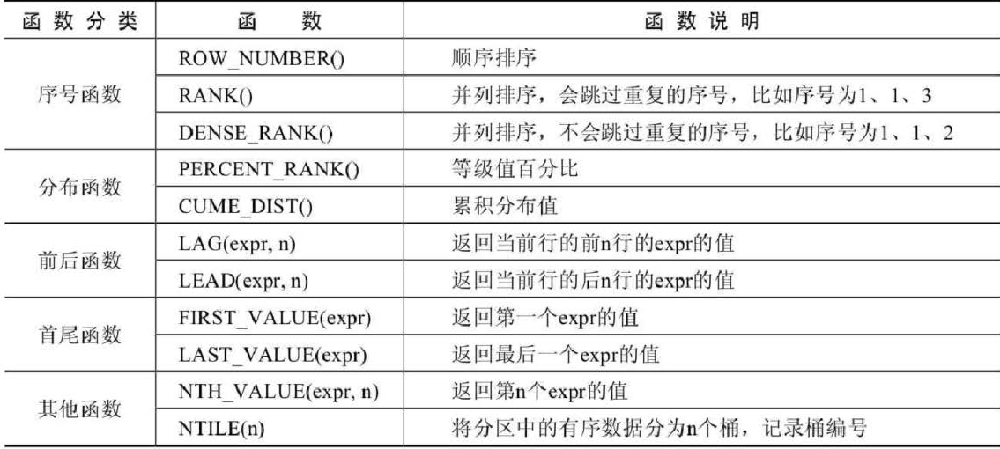

### 1. GROUP BY & HAVING

- GROUP BY 写在 ORDER BY 之前，先分组再排序；
- 对分组后的数据进行筛选，用 HAVING，类似于 WHERE；
- HAVING 不能单独使用，需要和 GROUP BY 一起使用；
- WHERE 不能使用聚合函数，HAVING 可以使用聚合函数；

```sql
SELECT position, MAX(age)
FROM student
GROUP BY position HAVING MAX(age)>20;
```

### 2. SELECT 执行过程

```sql
-- 方式1：
SELECT ...,....,...
FROM ...,...,....
WHERE 多表的连接条件
AND 不包含组函数的过滤条件
GROUP BY ...,...
HAVING 包含组函数的过滤条件
ORDER BY ... ASC/DESC
LIMIT ...,...

-- 方式2：复杂查询
SELECT ...,....,...
FROM ... 表A
JOIN .表B. ON 多表的连接条件
JOIN .表c. ON 多表的连接条件
WHERE 不包含组函数的过滤条件
AND/OR 不包含组函数的过滤条件
GROUP BY ...,...
HAVING 包含组函数的过滤条件
ORDER BY ... ASC/DESC
LIMIT ...,...

#其中：
#（1）from：从哪些表中筛选
#（2）on：关联多表查询时，去除笛卡尔积
#（3）where：从表中筛选的条件
#（4）group by：分组依据
#（5）having：在统计结果中再次筛选
#（6）order by：排序
#（7）limit：分页
```

**你需要记住 SELECT 查询时的两个顺序：**

**1. 关键字的顺序是不能颠倒的：**

```sql
SELECT ... FROM ... WHERE ... GROUP BY ... HAVING ... ORDER BY ... LIMIT...
```

**2. SELECT 语句的执行顺序**

```sql
FROM -> WHERE -> GROUP BY -> HAVING -> SELECT 的字段 -> DISTINCT -> ORDER BY -> LIMIT
```

### 3. 子查询和约束

#### （1）子查询

> 子查询指一个查询语句嵌套在另一个查询语句内部的查询，这个特性从 MySQL4.1 开始引入。

SQL中子查询的使用大大增强了 SELECT 查询的能力，因为很多时候查询需要从结果集中获取数据，或者需要从同个表中先计算得出一个数据结果，然后与这个数据结果(可能是某个标量，也可能是某个集合)进行比较。


- 子查询在主查询之前一次完成；
- 子查询结果被主查询使用；
- 注意
  - 子查询要包含在括号内
  - 将子查询放在比较条件的右侧
  - 单行操作符对应单行子查询，多行操作符对应多行子查询
- 分类
  - 根据返回数据行数：单行子查询和多行子查询
  - 根据需要执行次数：相关子查询（多次）和非相关子查询（单次）

#### （2）约束

> 约束是表级的强制规定。可以在创建表时规定约束(通过 CREATE TABLE 语句)，或者在表创建之后通过 ALTER TABLE 语句规定约束；

- 为什么需要约束？

> 数据完整性(DataIntegrity)是指数据的精确性(Accuracy)和可靠性(Reliability)。它是防止数据库中存在不符合语义规定的数据和防止因错误信息的输入输出造成无效操作或错误信息而提出的。为了保证数据的完整性，SQL规范以约束的方式对表数据进行额外的条件限制。从以下四个方面考虑:
>
> - 实体完整性(Entity Integriy): 例如, 同一个表中，不能存在两条完全相同无法区分的记录;
> - 域完整性(Domain Integrity): 例如, 年龄范围 0-120，性别范围"男/女";
> - 引用完整性(Referential Integrity): 例如, 员工所在部门，在部门表中要能找到这个部门;
> - 用户自定义完整性(User-defined Integrity): 例如, 用户名唯一、密码不能为空等，本部门经理的工资不得高于本部门职工的平均工资的5倍。

- 约束分类
- > - 根据约束数据列：单列约束 & 多列约束
  > - 根据约束作用范围：列级约束 & 表级约束
  >

* **根据约束起的作用，可以分为：**
  * **NOT NULL 非空约束，规定某个字段不能为空**
  * **UNIQUE 唯一约束，规定某个字段在整个表中是唯一的**
  * **PRIMARY KEY 主键(非空且唯一)约束**
  * **FOREIGN KEY 外键约束**
  * **CHECK 检查约束**
  * **DEFAULT 默认值约束**

- 查看某个表已有的约束

  ```sql
  #information_schema数据库名（系统库）
  #table_constraints表名称（专门存储各个表的约束）
  SELECT * FROM information_schema.table_constraints
  WHERE table_name = '表名称';
  ```

> ## 常见面试题
>
> **面试1、为什么建表时，加 not null default '' 或 default 0**
>
> **答：不想让表中出现null值。**
>
> **面试2、为什么不想要 null 的值**
>
> **（1）不好比较。null是一种特殊值，比较时只能用专门的is null 和 is not null来比较。碰到运算符，通常返回null。**
>
> **（2）效率不高。影响提高索引效果。因此，我们往往在建表时 not null default '' 或 default 0**
>
> **面试3、带AUTO_INCREMENT约束的字段值是从1开始的吗？**
>
> **在MySQL中，默认AUTO\_INCREMENT的初始值是1，每新增一条记录，字段值自动加1。设置自增属性（AUTO\_INCREMENT）的时候，还可以指定第一条插入记录的自增字段的值，这样新插入的记录的自增字段值从初始值开始递增，如在表中插入第一条记录，同时指定id值为5，则以后插入的记录的id值就会从6开始往上增加。添加主键约束时，往往需要设置字段自动增加属性。**
>
> **面试4、并不是每个表都可以任意选择存储引擎？**
>
> **MySQL支持多种存储引擎，每一个表都可以指定一个不同的存储引擎，需要注意的是：外键约束是用来保证数据的参照完整性的，如果表之间需要关联外键，却指定了不同的存储引擎，那么这些表之间是不能创建外键约束的。所以说，存储引擎的选择也不完全是随意的。**

### 4. 视图与存储过程

#### （1）视图 ❤️

- 常见的数据库对象


| 对象         | 描述                                                                                                 |
| ------------ | ---------------------------------------------------------------------------------------------------- |
| 表(TABLE)    | 表是存储数据的逻辑单元，以行和列的形式存在，列就是字段，行就是记录                                   |
| 数据字典     | 就是系统表，存放数据库相关信息的表。系统表的数据通常由数据库系统维护，程序员通常不应该修改，只可查看 |
| 约束         |                                                                                                      |
| (CONSTRAINT) | 执行数据校验的规则，用于保证数据完整性的规则                                                         |
| 视图(VIEW)   | 一个或者多个数据表里的数据的逻辑显示，视图并不存储数据                                               |
| 索引(INDEX)  | 用于提高查询性能，相当于书的目录                                                                     |
| 存储过程     |                                                                                                      |
| (PROCEDURE)  | 用于完成一次完整的业务处理，没有返回值，但可通过传出参数将多个值传给调用环境                         |
| 存储函数     |                                                                                                      |
| (FUNCTION)   | 用于完成一次特定的计算，具有一个返回值                                                               |
| 触发器       |                                                                                                      |
| (TRIGGER)    | 相当于一个事件监听器，当数据库发生特定事件后，触发器被触发，完成相应的处理                           |

- 为什么使用视图？❤️

视图一方面可以帮我们使用表的一部分而不是所有的表，另一方面也可以针对不同的用户制定不同的查询视图。比如，针对一个公司的销售人员，我们只想给他看部分数据，而某些特殊的数据，比如采购的价格，则不会提供给他。再比如，人员薪酬是个敏感的字段，那么只给某个级别以上的人员开放，其他人的查询视图中则不提供这个字段。刚才讲的只是视图的一个使用场景，实际上视图还有很多作用。最后，我们总结视图的优点。


> - 视图是一种虚拟表，本身是不具有数据的，占用很少的内存空间，它是SQL中的一个重要概念。
> - 视图建立在已有表的基础上,视图赖以建立的这些表称为基表。
> - 视图的创建和删除只影响视图本身，不影响对应的基表。但是当对视图中的数据进行增加、删除和修改操作时，数据表中的数据会相应地发生变化，反之亦然。
> - 向视图提供数据内容的语句为 SELECT 语句, 可以将视图理解为存储起来的 SELECT 语句。在数据库中，视图不会保存数据，数据真正保存在数据表中。当对视图中的数据进行增加、删除和修改操作时，数据表中的数据会相应地发生变化; 反之亦然。
> - 视图，是向用户提供基表数据的另一种表现形式。通常情况下，小型项目的教据库可以不使用视图，但是在大型项目中，以及数据表比较复杂的情况下，视图的价值就凸显出来了，它可以帮助我们把经常查询的结果集放到虚拟表中，提升使用效率。理解和使用起来都非常方便。
> - 当我们创建好一张视图之后，还可以在它的基础上继续创建视图。

- 创建单表视图

[ALGORITHM = {UNDEFINED | MERGE | TEMPTABLE}]
VIEW 视图名称 [(字段列表)]
AS 查询语句
[WITH [CASCADED|LOCAL] CHECK OPTION]
精简版

```sql
CREATE VIEW 视图名称
AS 查询语句
```

```sql
-- 视图创建
CREATE VIEW view01
AS
SELECT id, name, salary
FROM employees
WHERE dept_id = 9;
-- 视图查询
SELECT * FROM view01;
-- 视图 增 删 改
-- 视图删除
DELETE FROM view01 WHERE name='赵六';
UPDATE view01 SET salary=20000 WHERE name='Ben';
```


- 创建多表联合视图

```sql
-- 创建多表视图
CREATE VIEW view02
AS
SELECT e.id emp_id,e.name emp_name,d.name dept_name
FROM employees e,departments d
WHERE e.dept_id = d.id;
```

- 删除视图

```sql
-- 删除视图
DROP VIEW view02;
```

#### (2) 存储过程 ❤️

> **含义**：存储过程的英文是 Stored Procedure 。它的思想很简单，就是一组经过预先编译的 SQL 语句的封装。
>
> **执行过程**：存储过程预先存储在 MySQL 服务器上，需要执行的时候，客户端只需要向服务器端发出调用存储过程的命令，服务器端就可以把预先存储好的这一系列 SQL 语句全部执行。

- **好处**

**1、简化操作，提高了sql语句的重用性，减少了开发程序员的压力**

**2、减少操作过程中的失误，提高效率**

**3、减少网络传输量（客户端不需要把所有的 SQL 语句通过网络发给服务器)**

**4、减少了 SQL 语句暴露在网上的风险，也提高了数据查询的安全性**

> 它和视图有着同样的优点，清晰、安全，还可以减少网络传输量。不过它和视图不同，视图是虚拟表，通常不对底层数据表直接操作，而存储过程是程序化的 SQL，可以直接操作底层数据表，相比于面向集合的操作方式，能够实现一些更复杂的数据处理。
>
> 一旦存储过程被创建出来，使用它就像使用函数一样简单，我们直接通过调用存储过程名即可。相较于函数，存储过程是没有返回值的。

- 分类

存储过程的参数类型可以是IN、OUT和INOUT。（存储过程本身没有返回值，可以通过 OUT / INOUT 获取输出参数，相当于返回值）

```sql
CREATE PROCEDURE 存储过程名(IN|OUT|INOUT 参数名 参数类型,...)
[characteristics ...]
BEGIN
	存储过程体sql,不止一条;

END
```

characteristics **表示创建存储过程时指定的对存储过程的约束条件，其取值信息如下：**

```sql
LANGUAGE SQL
| [NOT] DETERMINISTIC
| { CONTAINS SQL | NO SQL | READS SQL DATA | MODIFIES SQL DATA }
| SQL SECURITY { DEFINER | INVOKER }
| COMMENT 'string'
```

> - LANGUAGE SQL** ：说明存储过程执行体是由SQL语句组成的，当前系统支持的语言为SQL。**
>
> * [NOT] DETERMINISTIC **：指明存储过程执行的结果是否确定。DETERMINISTIC表示结果是确定的。每次执行存储过程时，相同的输入会得到相同的输出。NOT DETERMINISTIC表示结果是不确定的，相同的输入可能得到不同的输出。如果没有指定任意一个值，默认为NOT DETERMINISTIC。**
> * { CONTAINS SQL | NO SQL | READS SQL DATA | MODIFIES SQL DATA } **：指明子程序使用SQL语句的限制。**
>   * **CONTAINS SQL表示当前存储过程的子程序包含SQL语句，但是并不包含读写数据的SQL语句；**
>   * **NO SQL表示当前存储过程的子程序中不包含任何SQL语句；**
>   * **READS SQL DATA表示当前存储过程的子程序中包含读数据的SQL语句；**
>   * **MODIFIES SQL DATA表示当前存储过程的子程序中包含写数据的SQL语句。** **默认情况下，系统会指定为CONTAINS SQL。**
> * SQL SECURITY { DEFINER | INVOKER } **：执行当前存储过程的权限，即指明哪些用户能够执行当前存储过程。**
>   * DEFINER** 表示只有当前存储过程的创建者或者定义者才能执行当前存储过程；**
>   * INVOKER **表示拥有当前存储过程的访问权限的用户能够执行当前存储过程。**
>   * **如果没有设置相关的值，则MySQL默认指定值为DEFINER。**
> * COMMENT 'string' **：注释信息，可以用来描述存储过程。**

- 调用

存储过程有多种调用方法。存储过程必须使用CALL语句调用，并且存储过程和数据库相关，如果要执行其他数据库中的存储过程，需要指定数据库名称，例如CALL dbname.procname。

```sql
CALL 存储过程名(实参列表)
```


|          | 关键字    | 调用语法        | 返回值        | 应用场景                         |
| -------- | --------- | --------------- | ------------- | -------------------------------- |
| 存储过程 | PROCEDURE | CALL 存储过程() | 为有0个或多个 | 一般用于更新                     |
| 存储函数 | FUNCTION  | SELECT 函数()   | 只能是一个    | 一般用于查询结果为一个值并返回时 |

```sql
SELECT 函数名(实参列表)
```

### 5. 变量 和 流程控制

> 在MySQL数据库的存储过程和函数中，可以使用变量来存储查询或计算的中间结果数据，或者输出最终的结果数据。**在 MySQL 数据库中，变量分为**系统变量**以及**用户自定义变量.

#### （1）系统变量

**变量由系统定义，不是用户定义，属于**服务器**层面。启动MySQL服务，生成MySQL服务实例期间，MySQL将为MySQL服务器内存中的系统变量赋值，这些系统变量定义了当前MySQL服务实例的属性、特征。这些系统变量的值要么是**编译MySQL时参数**的默认值，要么是**配置文件（例如my.ini等）中的参数值。

大家可以通过网址[https://dev.mysql.com/doc/refman/8.0/en/server-system-variable-reference.html](https://dev.mysql.com/doc/refman/8.0/en/server-system-variable-reference.html)查看MySQL文档的系统变量。

**系统变量分为全局系统变量（需要添加**global **关键字）以及会话系统变量（需要添加** session 关键字），有时也把全局系统变量简称为全局变量，有时也把会话系统变量称为local变量。如果不写，默认会话级别。静态变量（在 MySQL 服务实例运行期间它们的值不能使用 set 动态修改）属于特殊的全局系统变量。

> - **全局系统变量针对于所有会话（连接）有效，但**不能跨重启
> - **会话系统变量仅针对于当前会话（连接）有效。会话期间，当前会话对某个会话系统变量值的修改，不会影响其他会话同一个会话系统变量的值。**
> - **会话1对某个全局系统变量值的修改会导致会话2中同一个全局系统变量值的修改。**

```sql
-- 查看所有全局变量
SHOW GLOBAL VARIABLES;

-- 查看所有会话变量
SHOW SESSION VARIABLES;
或
SHOW VARIABLES;

-- 查看满足条件的部分系统变量。
SHOW GLOBAL VARIABLES LIKE '%标识符%';

#查看满足条件的部分会话变量
SHOW SESSION VARIABLES LIKE '%标识符%';
SHOW GLOBAL VARIABLES LIKE 'admin_%';
```

> 作为 MySQL 编码规范，MySQL 中的系统变量以两个“@” 开头，其中“@@global”仅用于标记全局系统变量，“@@session”仅用于标记会话系统变量。“@@”首先标记会话系统变量，如果会话系统变量不存在，则标记全局系统变量。

```sql
#查看指定的系统变量的值
SELECT @@global.变量名;

#查看指定的会话变量的值
SELECT @@session.变量名;

#或者
SELECT @@变量名;
```

```sql
-- 修改最大连接
SELECT @@global.max_connections;
SET GLOBAL max_connections = 1000;
SELECT @@global.max_connections;
```

#### （2）自定义变量

**用户变量是用户自己定义的，作为 MySQL 编码规范，MySQL 中的用户变量以**一个“@” **开头。根据作用范围不同，又分为**会话用户变量**和**局部变量。

* **会话用户变量：作用域和会话变量一样，只对**当前连接**会话有效。**
* **局部变量：只在 BEGIN 和 END 语句块中有效。局部变量只能在**存储过程和函数**中使用。**

```sql
#方式1：“=”或“:=”
SET @用户变量 = 值;
SET @用户变量 := 值;

#方式2：“:=” 或 INTO关键字
SELECT @用户变量 := 表达式 [FROM 等子句];
SELECT 表达式 INTO @用户变量 [FROM 等子句];
```

```sql
SET @a = 1;
SELECT @a;
SELECT @big; #查看某个未声明的变量时，将得到NULL值
```

```sql
BEGIN
	-- 声明局部变量
	DECLARE 变量名1 变量数据类型 [DEFAULT 变量默认值];
	DECLARE 变量名2,变量名3,... 变量数据类型 [DEFAULT 变量默认值];

	-- 为局部变量赋值
	SET 变量名1 = 值;
	SELECT 值 INTO 变量名2 [FROM 子句];

	-- 查看局部变量的值
	SELECT 变量1,变量2,变量3;
END
```

```sql
DECLARE 变量名 类型 [default 值]; # 如果没有DEFAULT子句，初始值为NULL
```

#### （3）流程控制

略

#### （4）游标

> 游标，提供了一种灵活的操作方式，让我们能够对结果集中的每一条记录进行定位，并对指向的记录中的数据进行操作的数据结构。游标让 SQL 这种面向集合的语言有了面向过程开发的能力。
>
> **在 SQL 中，游标是一种临时的数据库对象，可以指向存储在数据库表中的数据行指针。这里游标**充当了指针的作用，我们可以通过操作游标来对数据行进行操作。

- 声明游标
  ```sql
  DECLARE cursor_name CURSOR FOR select_statement;
  ```

> 要使用 SELECT 语句来获取数据结果集，而此时还没有开始遍历数据，这里 select\_statement 代表的是SELECT 语句，返回一个用于创建游标的结果集。

```sql
DECLARE cur_emp CURSOR FOR
SELECT id,salary FROM employees;
```

- 打开游标

```sql
OPEN cursor_name
```

> **当我们定义好游标之后，如果想要使用游标，必须先打开游标。打开游标的时候 SELECT 语句的查询结果集就会送到游标工作区，为后面游标的**逐条读取结果集中的记录做准备。

- 使用游标

```sql
FETCH cursor_name INTO var_name [, var_name] ...
```

> 这句的作用是使用 cursor\_name 这个游标来读取当前行，并且将数据保存到 var\_name 这个变量中，游标指针指到下一行。如果游标读取的数据行有多个列名，则在 INTO 关键字后面赋值给多个变量名即可。

- 关闭游标

```sql
CLOSE cursor_name
```

> **有 OPEN 就会有 CLOSE，也就是打开和关闭游标。当我们使用完游标后需要关闭掉该游标。因为游标会**占用系统资源，如果不及时关闭，****游标会一直保持到存储过程结束**，影响系统运行的效率。而关闭游标** 的操作，会释放游标占用的系统资源。

👍 MySQL 8.0版本新增了SET PERSIST 命令。**MySQL会将该命令的配置保存到数据目录下的** mysqld-auto.cnf 文件中，下次启动时会读取该文件，用其中的配置来覆盖默认的配置文件。(全局变量的持久化)

```sql
SET PERSIST global max_connections = 1000;
```

### 6. 触发器

MySQL从5.0.2 版本开始支持触发器。MySQL的触发器和存储过程一样，都是嵌入到MySQL服务器的一段程序。

> 触发器是由事件来触发某个操作，这些事件包括INSERT、UPDATE、DELETE 事件。所谓事件就是指用户的动作或者触发某项行为。如果定义了触发程序，当数据库执行这些语句时候，就相当于事件发生了，就会自动激发触发器执行相应的操作。
>
> 当对数据表中的数据执行插入、更新和删除操作，需要自动执行一些数据库逻辑时，可以使用触发器来实现。

- 创建触发器
  ```sql
  CREATE TRIGGER 触发器名称
  {BEFORE|AFTER} {INSERT|UPDATE|DELETE} ON 表名
  FOR EACH ROW
  触发器执行的语句块;
  ```

> - 表名: 表示触发器监控的对象
> - BEFORE|AFTER: 表示触发的时间。BEFORE 表示在事件之前触发; AFTER 表示在事件之后触发。
> - INSERT|UPDATE|DELETE: 表示触发的事件
>   - INSERT 表示插入记录时触发;
>   - UPDATE 表示更新记录时触发;
>   - DELETE 表示删除记录时触发。
> - 触发器执行的语句块: 可以是单条SQL语句，也可以是由BEGIN...END结构组成的复合语句块。

- 删除触发器

```sql
DROP TRIGGER IF EXISTS 触发器名称;
```

- 优缺点
- > - 触发器可以确保数据的完整性
  > - 触发器可以帮助我们记录操作日志
  > - 触发器还可以用在操作数据前，对数据进行合法性检查
  >
  > 缺点：
  >
- > - 可读性差
  > - 相关数据的变更(如数据表结构的变更)，可能会导致触发器出错
  >

### 7. 索引

#### （1）存储引擎

- 存储引擎就是存储数据、建立索引、更新/查询数据等技术的实现方式。
- 存储引擎是基于表的，而不是基于库的，所以存储引擎也可被称为表类型。❤️
- 我们可以在创建表的时候，来指定选择的存储引擎，如果没有指定将自动选择默认的存储引擎。

```sql
CREATE TABLE 表名(
  
字段1 字段1类型 [ COMMENT 字段1注释 ] ,
......
字段n 字段n类型 [COMMENT 字段n注释 ]
  
) -- ENGINE = INNODB/myisam [ COMMENT 表注释 ] ;
```

```sql
show engines; -- 查询当前数据库支持的存储引擎
SHOW CREATE TABLE student; -- 查询建表语句
```

```sql
create table my_myisam(
id int,
name varchar(10)
) engine = MyISAM ;
```

#### （2）各个引擎的特点

- InnoDB是一种兼顾高可靠性和高性能的通用存储引擎，在 MySQL 5.5 之后，InnoDB是默认的MySQL 存储引擎。
  * **DML操作遵循ACID模型，支持事务；**
  * **行级锁**，提高并发访问性能；
  * **支持外键FOREIGN KEY约束**，保证数据的完整性和正确性；
- MyISAM是MySQL早期的默认存储引擎。
  * 不支持事务，不支持外键
  * 支持表锁，不支持行锁
  * 访问速度快
- Memory引擎的表数据时存储在内存中的，由于受到硬件问题、或断电问题的影响，只能将这些表作为临时表或缓存使用。
  * **内存存放**
  * **hash索引（默认）**

> **面试题:**
>
> **InnoDB引擎与MyISAM引擎的区别 ?**
>
> **①. InnoDB引擎, 支持事务, 而MyISAM不支持。**
>
> **②. InnoDB引擎, 支持行锁和表锁, 而MyISAM仅支持表锁, 不支持行锁。**
>
> **③. InnoDB引擎, 支持外键, 而MyISAM是不支持的。**
>
> **主要是上述三点区别，当然也可以从索引结构、存储限制等方面，更加深入的回答，具体参考如下官方文档：**

#### （3）索引语法

- 创建索引

  ```sql
  CREATE [ UNIQUE | FULLTEXT ] INDEX index_name ON table_name (
  	index_col_name,... 
  ) ;
  ```
- 查看索引

```sql
SHOW INDEX FROM table_name;
```

- 删除索引

```sql
DROP INDEX index_name ON table_name;
```

### 8. 事务与锁

#### （1）事务

事务是一组操作的集合，它是一个不可分割的工作单位，事务会把所有的操作作为一个整体一起向系统提交或撤销操作请求，即这些操作要么同时成功，要么同时失败。

```sql
-- 开启事务
start transaction/ BEGIN;

-- 1. 查询张三余额
select * from account where name = '张三';

-- 2. 张三的余额减少1000
update account set money = money - 1000 where name = '张三';

出错了。。。
-- 3. 李四的余额增加1000
update account set money = money + 1000 where name = '李四';

-- 如果正常执行完毕, 则提交事务
commit;

-- 如果执行过程中报错, 则回滚事务
-- rollback;
```

- 事务四大特性 ACID

  - 原子性(Atomicity): 事务是不可分割的最小操作单元，要么全部成功，要么全部失败。
  - 一致性(Consistency): 事务完成时，必须使所有的数据都保持一致状态
  - 隔离性(Isolation): 数据库系统提供的隔离机制，保证事务在不受外部并发操作影响的独立环境下运行。
  - 持久性(Durability): 事务一旦提交或回滚，它对数据库中的数据的改变就是永久的。
- 事务隔离级别
- 事务原理 - redo log / undo log
- MVCC (Multi-Version Concurrency Control)

#### （2）锁机制

> 锁是计算机协调多个进程或线程并发访问某一资源的机制。

- 按锁的粒度分类

  - 全局锁：全局锁就是对整个数据库实例加锁，加锁后整个实例就处于只读状态，后续的DML的写语句，DDL语句，已经更新操作的事务提交语句都将被阻塞。
  - 表级锁
  - 行级锁
  - 页锁：页锁是MySQL中锁定粒度介于行级锁和表级锁中间的一种锁。表级锁速度快，但冲突多，行级冲突少，但速度慢。所以取了折衷的页级，一次锁定相邻的一组记录
- 按数据操作类型分类

  - 读锁 / 共享锁
  - 写锁 / 排他锁
- 全局锁

```sql
flush tables with read lock; -- 加锁
unlock tables; -- 释放锁
```

- 表锁

```sql
lock table 表名字 read(write),表名字2 read(write) -- 加锁
unlock tables; -- 释放锁
show open tables -- 查看表上加过的锁的命令
```

- 元数据锁

meta data lock , 元数据锁，简写MDL。MDL加锁过程是系统自动控制，无需显式使用，在访问一张表的时候会自动加上。MDL锁主要作用是维护表元数据的数据一致性，在表上有活动事务的时候，不可以对元数据进行写入操作。为了避免DML与DDL冲突，保证读写的正确性。

- 行锁


# MySQL8.0及新特性

MySQL从5.7版本直接跳跃发布了8.0版本**，可见这是一个令人兴奋的里程碑版本。MySQL 8版本在功能上做了显著的改进与增强，开发者对MySQL的源代码进行了重构，最突出的一点是多MySQL Optimizer优化器进行了改进。不仅在速度上得到了改善，还为用户带来了更好的性能和更棒的体验。**

## 1. MySQL8新特性概述

### 1.1 MySQL8.0 新增特性

**1. 更简便的NoSQL支持** NoSQL泛指非关系型数据库和数据存储。随着互联网平台的规模飞速发展，传统的关系型数据库已经越来越不能满足需求。从5.6版本开始，MySQL就开始支持简单的NoSQL存储功能。MySQL 8对这一功能做了优化，以更灵活的方式实现NoSQL功能，不再依赖模式（schema）。

**2. 更好的索引** 在查询中，正确地使用索引可以提高查询的效率。MySQL 8中新增了隐藏索引**和**降序索引**。隐藏索引可以用来测试去掉索引对查询性能的影响。在查询中混合存在多列索引时，使用降序索引可以提高查询的性能。**

**3. 更完善的JSON支持** MySQL从5.7开始支持原生JSON数据的存储，MySQL 8对这一功能做了优化，增加了聚合函数JSON\_ARRAYAGG() 和JSON\_OBJECTAGG() ，将参数聚合为JSON数组或对象，新增了行内操作符 ->>，是列路径运算符 ->的增强，对JSON排序做了提升，并优化了JSON的更新操作。

**4. 安全和账户管理** MySQL 8中新增了caching\_sha2\_password 授权插件、角色、密码历史记录和FIPS模式支持，这些特性提高了数据库的安全性和性能，使数据库管理员能够更灵活地进行账户管理工作。

**5. InnoDB的变化 InnoDB是MySQL默认的存储引擎**，是事务型数据库的首选引擎，支持事务安全表（ACID），支持行锁定和外键。在MySQL 8 版本中，InnoDB在自增、索引、加密、死锁、共享锁等方面做了大量的改进和优化，并且支持原子数据定义语言（DDL），提高了数据安全性，对事务提供更好的支持。

**6.数据字典** 在之前的MySQL版本中，字典数据都存储在元数据文件和非事务表中。从MySQL 8开始新增了事务数据字典，在这个字典里存储着数据库对象信息，这些数据字典存储在内部事务表中。

**7. 原子数据定义语句** MySQL 8开始支持原子数据定义语句（Automic DDL），即原子DDL 。目前，只有InnoDB存储引擎支持原子DDL。原子数据定义语句（DDL）将与DDL操作相关的数据字典更新、存储引擎操作、二进制日志写入结合到一个单独的原子事务中，这使得即使服务器崩溃，事务也会提交或回滚。使用支持原子操作的存储引擎所创建的表，在执行DROP TABLE、CREATE TABLE、ALTER TABLE、RENAME TABLE、TRUNCATE TABLE、CREATE TABLESPACE、DROP TABLESPACE等操作时，都支持原子操作，即事务要么完全操作成功，要么失败后回滚，不再进行部分提交。 对于从MySQL 5.7复制到MySQL 8版本中的语句，可以添加IF EXISTS** 或**IF NOT EXISTS** 语句来避免发生错误。**

**8. 资源管理** MySQL 8开始支持创建和管理资源组，允许将服务器内运行的线程分配给特定的分组，以便线程根据组内可用资源执行。组属性能够控制组内资源，启用或限制组内资源消耗。数据库管理员能够根据不同的工作负载适当地更改这些属性。 目前，CPU时间是可控资源，由“虚拟CPU”这个概念来表示，此术语包含CPU的核心数，超线程，硬件线程等等。服务器在启动时确定可用的虚拟CPU数量。拥有对应权限的数据库管理员可以将这些CPU与资源组关联，并为资源组分配线程。 资源组组件为MySQL中的资源组管理提供了SQL接口。资源组的属性用于定义资源组。MySQL中存在两个默认组，系统组和用户组，默认的组不能被删除，其属性也不能被更改。对于用户自定义的组，资源组创建时可初始化所有的属性，除去名字和类型，其他属性都可在创建之后进行更改。 在一些平台下，或进行了某些MySQL的配置时，资源管理的功能将受到限制，甚至不可用。例如，如果安装了线程池插件，或者使用的是macOS系统，资源管理将处于不可用状态。在FreeBSD和Solaris系统中，资源线程优先级将失效。在Linux系统中，只有配置了CAP\_SYS\_NICE属性，资源管理优先级才能发挥作用。

**9. 字符集支持** MySQL 8中默认的字符集由latin1 更改为utf8mb4 ，并首次增加了日语所特定使用的集合，utf8mb4\_ja\_0900\_as\_cs。

**10. 优化器增强** MySQL优化器开始支持隐藏索引和降序索引。隐藏索引不会被优化器使用，验证索引的必要性时不需要删除索引，先将索引隐藏，如果优化器性能无影响就可以真正地删除索引。降序索引允许优化器对多个列进行排序，并且允许排序顺序不一致。

**11. 公用表表达式** 公用表表达式（Common Table Expressions）简称为CTE，MySQL现在支持递归和非递归两种形式的CTE。CTE通过在SELECT语句或其他特定语句前使用WITH语句对临时结果集**进行命名。**

**基础语法如下：**

```sql
WITH cte_name (col_name1,col_name2 ...) AS (Subquery)
SELECT * FROM cte_name;
```

**Subquery代表子查询，子查询前使用WITH语句将结果集命名为cte\_name，在后续的查询中即可使用cte\_name进行查询。**

**12. 窗口函数** MySQL 8开始支持窗口函数。在之前的版本中已存在的大部分聚合函数在MySQL 8中也可以作为窗口函数来使用。



**13. 正则表达式支持** MySQL在8.0.4以后的版本中采用支持Unicode的国际化组件库实现正则表达式操作，这种方式不仅能提供完全的Unicode支持，而且是多字节安全编码。MySQL增加了REGEXP\_LIKE()、EGEXP\_INSTR()、REGEXP\_REPLACE()和 REGEXP\_SUBSTR()等函数来提升性能。另外，regexp\_stack\_limit和regexp\_time\_limit 系统变量能够通过匹配引擎来控制资源消耗。

**14. 内部临时表** TempTable存储引擎取代MEMORY存储引擎成为内部临时表的默认存储引擎**。TempTable存储引擎为VARCHAR和VARBINARY列提供高效存储。internal\_tmp\_mem\_storage\_engine会话变量定义了内部临时表的存储引擎，可选的值有两个，TempTable和MEMORY，其中TempTable为默认的存储引擎。temptable\_max\_ram系统配置项定义了TempTable存储引擎可使用的最大内存数量。**

**15. 日志记录** 在MySQL 8中错误日志子系统由一系列MySQL组件构成。这些组件的构成由系统变量log\_error\_services来配置，能够实现日志事件的过滤和写入。

**16.备份锁** 新的备份锁允许在线备份期间执行数据操作语句，同时阻止可能造成快照不一致的操作。新备份锁由 LOCK INSTANCE FOR BACKUP 和 UNLOCK INSTANCE 语法提供支持，执行这些操作需要备份管理员特权。

**17.增强的MySQL复制** MySQL 8复制支持对JSON文档**进行部分更新的**二进制日志记录**，该记录使用**紧凑的二进制格式**，从而节省记录完整JSON文档的空间。当使用基于语句的日志记录时，这种紧凑的日志记录会自动完成，并且可以通过将新的binlog\_row\_value\_options系统变量值设置为PARTIAL\_JSON来启用。**

### 1.2 MySQL8.0移除的旧特性

**在MySQL 5.7版本上开发的应用程序如果使用了MySQL8.0 移除的特性，语句可能会失败，或者产生不同的执行结果。为了避免这些问题，对于使用了移除特性的应用，应当尽力修正避免使用这些特性，并尽可能使用替代方法。**

**1. 查询缓存** 查询缓存已被移除，删除的项有：

**（1）语句**：FLUSH QUERY CACHE和RESET QUERYCACHE。

**（2）系统变量**：query\_cache\_limit、query\_cache\_min\_res\_unit、query\_cache\_size、query\_cache\_type、query\_cache\_wlock\_invalidate。

**（3）状态变量**：Qcache\_free\_blocks、Qcache\_free\_memory、Qcache\_hits、Qcache\_inserts、Qcache\_lowmem\_prunes、Qcache\_not\_cached、Qcache\_queries\_in\_cache、Qcache\_total\_blocks。

**（4）线程状态**：checking privileges on cached query、checking query cache for query、invalidating query cache entries、sending cached result to client、storing result in query cache、waiting for query cache lock。

**2. 加密相关** 删除的加密相关的内容有：ENCODE()、DECODE()、ENCRYPT()、DES\_ENCRYPT()和DES\_DECRYPT()函数，配置项des-key-file，系统变量have\_crypt，FLUSH语句的DES\_KEY\_FILE选项，HAVE\_CRYPT CMake选项。 对于移除的ENCRYPT()函数，考虑使用SHA2()替代，对于其他移除的函数，使用AES\_ENCRYPT() AES\_DECRYPT()替代。

**3.空间函数相关** 在MySQL 5.7版本中，多个空间函数已被标记为过时。这些过时函数在MySQL 8中都已被移除，只保留了对应的ST\_和MBR函数。

**4.\N和NULL** 在SQL语句中，解析器不再将\\N视为NULL，所以在SQL语句中应使用NULL代替\\N。这项变化不会影响使用LOAD DATA INFILE或者SELECT...INTO OUTFILE操作文件的导入和导出。在这类操作中，NULL仍等同于\\N。

**5. mysql_install_db** 在MySQL分布中，已移除了mysql\_install\_db程序，数据字典初始化需要调用带着--** **initialize或者--initialize-insecure选项的mysqld来代替实现。另外，--bootstrap和INSTALL\_SCRIPTDIRCMake也已被删除。

**6. 通用分区处理程序** 通用分区处理程序已从MySQL服务中被移除。为了实现给定表分区，表所使用的存储引擎需要自有的分区处理程序。 提供本地分区支持的MySQL存储引擎有两个，即InnoDB和NDB，而在MySQL 8中只支持InnoDB。

**7. 系统和状态变量信息>** 在INFORMATION\_SCHEMA数据库中，对系统和状态变量信息不再进行维护。GLOBAL\_VARIABLES、SESSION\_VARIABLES、GLOBAL\_STATUS、SESSION\_STATUS表都已被删除。另外，系统变量show\_compatibility\_56也已被删除。被删除的状态变量有Slave\_heartbeat\_period、Slave\_last\_heartbeat,Slave\_received\_heartbeats、Slave\_retried\_transactions、Slave\_running。以上被删除的内容都可使用性能模式中对应的内容进行替代。

**8. mysql_plugin工具** mysql\_plugin工具用来配置MySQL服务器插件，现已被删除，可使用--plugin-load或--plugin-load-add选项在服务器启动时加载插件 或者 在运行时使用INSTALL PLUGIN语句加载插件来替代该工具。

## 2. 新特性1：窗口函数

### 2.1 使用窗口函数前后对比

**假设我现在有这样一个数据表，它显示了某购物网站在每个城市每个区的销售额：**

```
CREATE TABLE sales(
    id INT PRIMARY KEY AUTO_INCREMENT,
    city VARCHAR(15),
    county VARCHAR(15),
    sales_value DECIMAL
);

INSERT INTO sales(city,county,sales_value)
VALUES
('北京','海淀',10.00),
('北京','朝阳',20.00),
('上海','黄埔',30.00),
('上海','长宁',10.00);
```

**查询：**

```
SELECT * FROM sales;
```

**需求：**现在计算这个网站在每个城市的销售总额、在全国的销售总额、每个区的销售额占所在城市销售额中的比率，以及占总销售额中的比率。如果用分组和聚合函数，就需要分好几步来计算。

**第一步，计算总销售金额，并存入临时表 a：**

```
CREATE TEMPORARY TABLE a -- 创建临时表
SELECT SUM(sales_value) AS sales_value -- 计算总计金额
FROM sales;
```

**查看一下临时表 a ：**

```
SELECT * FROM a;
```

**第二步，计算每个城市的销售总额并存入临时表 b：**

```
CREATE TEMPORARY TABLE b -- 创建临时表
SELECT city,SUM(sales_value) AS sales_value -- 计算城市销售合计
FROM sales
GROUP BY city;
```

**查看临时表 b ：**

```
SELECT * FROM b
```

**第三步，计算各区的销售占所在城市的总计金额的比例，和占全部销售总计金额的比例。我们可以通过下面的连接查询获得需要的结果：**

```
SELECT s.city AS 城市,s.county AS 区,s.sales_value AS 区销售额,
 b.sales_value AS 市销售额,s.sales_value/b.sales_value AS 市比率,
 a.sales_value AS 总销售额,s.sales_value/a.sales_value AS 总比率
 FROM sales s
 JOIN b ON (s.city=b.city) -- 连接市统计结果临时表
 JOIN a -- 连接总计金额临时表
 ORDER BY s.city,s.county;
```

**结果显示：市销售金额、市销售占比、总销售金额、总销售占比都计算出来了。**

**同样的查询，如果用窗口函数，就简单多了。我们可以用下面的代码来实现：**

```
SELECT city AS 城市,county AS 区,sales_value AS 区销售额,
SUM(sales_value) OVER(PARTITION BY city) AS 市销售额, -- 计算市销售额
sales_value/SUM(sales_value) OVER(PARTITION BY city) AS 市比率,
SUM(sales_value) OVER() AS 总销售额, -- 计算总销售额
sales_value/SUM(sales_value) OVER() AS 总比率
FROM sales
ORDER BY city,county;
```

**使用窗口函数，只用了一步就完成了查询。而且，由于没有用到临时表，执行的效率也更高了。很显然，****在这种需要用到分组统计的结果对每一条记录进行计算的场景下，使用窗口函数更好。**

### 2.2 窗口函数分类

**MySQL从8.0版本开始支持窗口函数。窗口函数的作用类似于在查询中对数据进行分组，不同的是，分组操作会把分组的结果聚合成一条记录，而窗口函数是将结果置于每一条数据记录中。**

**窗口函数可以分为**静态窗口函数**和**动态窗口函数**。**

* **静态窗口函数的窗口大小是固定的，不会因为记录的不同而不同；**
* **动态窗口函数的窗口大小会随着记录的不同而变化。**

**窗口函数总体上可以分为序号函数、分布函数、前后函数、首尾函数和其他函数，如下表：**



### 2.3 语法结构

**窗口函数的语法结构是：**

```
函数 OVER（[PARTITION BY 字段名 ORDER BY 字段名 ASC|DESC]）
```

**或者是：**

```
函数 OVER 窗口名 … WINDOW 窗口名 AS （[PARTITION BY 字段名 ORDER BY 字段名 ASC|DESC]）
```

* **OVER 关键字指定函数窗口的范围。**
  * **如果省略后面括号中的内容，则窗口会包含满足WHERE条件的所有记录，窗口函数会基于所有满足WHERE条件的记录进行计算。**
  * **如果OVER关键字后面的括号不为空，则可以使用如上语法设置窗口。**
* **窗口名：为窗口设置一个别名，用来标识窗口。**
* **PARTITION BY子句：指定窗口函数按照哪些字段进行分组。分组后，窗口函数可以在每个分组中分别执行。**
* **ORDER BY子句：指定窗口函数按照哪些字段进行排序。执行排序操作使窗口函数按照排序后的数据记录的顺序进行编号。**
* **FRAME子句：为分区中的某个子集定义规则，可以用来作为滑动窗口使用。**

### 2.4 分类讲解

**创建表：**

```
CREATE TABLE goods(
	id INT PRIMARY KEY AUTO_INCREMENT,
	category_id INT,
	category VARCHAR(15),
	NAME VARCHAR(30),
	price DECIMAL(10,2),
	stock INT,
	upper_time DATETIME
);
```

**添加数据：**

```
INSERT INTO goods(category_id,category,NAME,price,stock,upper_time)
VALUES
(1, '女装/女士精品', 'T恤', 39.90, 1000, '2020-11-10 00:00:00'),
(1, '女装/女士精品', '连衣裙', 79.90, 2500, '2020-11-10 00:00:00'),
(1, '女装/女士精品', '卫衣', 89.90, 1500, '2020-11-10 00:00:00'),
(1, '女装/女士精品', '牛仔裤', 89.90, 3500, '2020-11-10 00:00:00'),
(1, '女装/女士精品', '百褶裙', 29.90, 500, '2020-11-10 00:00:00'),
(1, '女装/女士精品', '呢绒外套', 399.90, 1200, '2020-11-10 00:00:00'),
(2, '户外运动', '自行车', 399.90, 1000, '2020-11-10 00:00:00'),
(2, '户外运动', '山地自行车', 1399.90, 2500, '2020-11-10 00:00:00'),
(2, '户外运动', '登山杖', 59.90, 1500, '2020-11-10 00:00:00'),
(2, '户外运动', '骑行装备', 399.90, 3500, '2020-11-10 00:00:00'),
(2, '户外运动', '运动外套', 799.90, 500, '2020-11-10 00:00:00'),
(2, '户外运动', '滑板', 499.90, 1200, '2020-11-10 00:00:00');
```

**下面针对goods表中的数据来验证每个窗口函数的功能。**

#### 1. 序号函数

**1．ROW\_NUMBER()函数**

**ROW\_NUMBER()函数能够对数据中的序号进行顺序显示。**

**举例：查询 goods 数据表中每个商品分类下价格降序排列的各个商品信息。**

```
SELECT ROW_NUMBER() OVER(PARTITION BY category_id ORDER BY price DESC) AS
row_num,id, category_id, category, NAME, price, stock
FROM goods;
```

**举例：查询 goods 数据表中每个商品分类下价格最高的3种商品信息。**

```
SELECT *
 FROM (
 SELECT ROW_NUMBER() OVER(PARTITION BY category_id ORDER BY price DESC) AS
row_num,
 id, category_id, category, NAME, price, stock
 FROM goods) t
 WHERE row_num <= 3;
```

**在名称为“女装/女士精品”的商品类别中，有两款商品的价格为89.90元，分别是卫衣和牛仔裤。两款商品的序号都应该为2，而不是一个为2，另一个为3。此时，可以使用RANK()函数和DENSE\_RANK()函数解决。**

**2．RANK()函数** **使用RANK()函数能够对序号进行并列排序，并且会跳过重复的序号，比如序号为1、1、3。**

**举例：使用RANK()函数获取 goods 数据表中各类别的价格从高到低排序的各商品信息。**

```
SELECT RANK() OVER(PARTITION BY category_id ORDER BY price DESC) AS row_num,
id, category_id, category, NAME, price, stock
FROM goods;
```

**举例：使用RANK()函数获取 goods 数据表中类别为“女装/女士精品”的价格最高的4款商品信息。**

```
SELECT *
FROM(
SELECT RANK() OVER(PARTITION BY category_id ORDER BY price DESC) AS row_num,
id, category_id, category, NAME, price, stock
FROM goods) t
WHERE category_id = 1 AND row_num <= 4;
```

**可以看到，使用RANK()函数得出的序号为1、2、2、4，相同价格的商品序号相同，后面的商品序号是不连续的，跳过了重复的序号。**

**3．DENSE\_RANK()函数**

**DENSE\_RANK()函数对序号进行并列排序，并且不会跳过重复的序号，比如序号为1、1、2。**

**举例：使用DENSE\_RANK()函数获取 goods 数据表中各类别的价格从高到低排序的各商品信息。**

```
SELECT DENSE_RANK() OVER(PARTITION BY category_id ORDER BY price DESC) AS
row_num,id, category_id, category, NAME, price, stock
FROM goods;
```

**举例：使用DENSE\_RANK()函数获取 goods 数据表中类别为“女装/女士精品”的价格最高的4款商品信息。**

```
SELECT *
FROM(
SELECT DENSE_RANK() OVER(PARTITION BY category_id ORDER BY price DESC) AS
row_num,id, category_id, category, NAME, price, stock FROM goods) t
WHERE category_id = 1 AND row_num <= 3;
```

**可以看到，使用DENSE\_RANK()函数得出的行号为1、2、2、3，相同价格的商品序号相同，后面的商品序** **号是连续的，并且没有跳过重复的序号。**

#### 2. 分布函数

**1．PERCENT\_RANK()函数**

**PERCENT\_RANK()函数是等级值百分比函数。按照如下方式进行计算。**

```
(rank - 1) / (rows - 1)
```

**其中，rank的值为使用RANK()函数产生的序号，rows的值为当前窗口的总记录数。**

**举例：计算 goods 数据表中名称为“女装/女士精品”的类别下的商品的PERCENT\_RANK值。**

```
-- 写法一：
SELECT RANK() OVER (PARTITION BY category_id ORDER BY price DESC) AS r,
PERCENT_RANK() OVER (PARTITION BY category_id ORDER BY price DESC) AS pr,
id, category_id, category, NAME, price, stock
FROM goods
WHERE category_id = 1;

-- 写法二：
SELECT RANK() OVER w AS r,
PERCENT_RANK() OVER w AS pr,
id, category_id, category, NAME, price, stock
FROM goods
WHERE category_id = 1 WINDOW w AS (PARTITION BY category_id ORDER BY price
DESC);
```

**2．CUME\_DIST()函数**

**CUME\_DIST()函数主要用于查询小于或等于某个值的比例。**

**举例：查询goods数据表中小于或等于当前价格的比例。**

```
SELECT CUME_DIST() OVER(PARTITION BY category_id ORDER BY price ASC) AS cd,
id, category, NAME, price FROM goods;
```

#### 3. 前后函数

**1．LAG(expr,n)函数**

**LAG(expr,n)函数返回当前行的前n行的expr的值。**

**举例：查询goods数据表中前一个商品价格与当前商品价格的差值。**

```
SELECT id, category, NAME, price, pre_price, price - pre_price AS diff_price
FROM (
SELECT id, category, NAME, price,LAG(price,1) OVER w AS pre_price
FROM goods
WINDOW w AS (PARTITION BY category_id ORDER BY price)) t;
```

**2．LEAD(expr,n)函数**

**LEAD(expr,n)函数返回当前行的后n行的expr的值。**

**举例：查询goods数据表中后一个商品价格与当前商品价格的差值。**

```
SELECT id, category, NAME, behind_price, price,behind_price - price AS
diff_price
FROM(
SELECT id, category, NAME, price,LEAD(price, 1) OVER w AS behind_price
FROM goods WINDOW w AS (PARTITION BY category_id ORDER BY price)) t;
```

#### 4. 首尾函数

**1．FIRST\_VALUE(expr)函数**

**FIRST\_VALUE(expr)函数返回第一个expr的值。**

**举例：按照价格排序，查询第1个商品的价格信息。**

```
SELECT id, category, NAME, price, stock,FIRST_VALUE(price) OVER w AS
first_price
FROM goods WINDOW w AS (PARTITION BY category_id ORDER BY price);
```

**2．LAST\_VALUE(expr)函数**

**LAST\_VALUE(expr)函数返回最后一个expr的值。**

**举例：按照价格排序，查询最后一个商品的价格信息。**

```
SELECT id, category, NAME, price, stock,LAST_VALUE(price) OVER w AS last_price
FROM goods WINDOW w AS (PARTITION BY category_id ORDER BY price);
```

#### 5. 其他函数

**1．NTH\_VALUE(expr,n)函数**

**NTH\_VALUE(expr,n)函数返回第n个expr的值。**

**举例：查询goods数据表中排名第2和第3的价格信息。**

```
SELECT id, category, NAME, price,NTH_VALUE(price,2) OVER w AS second_price,
NTH_VALUE(price,3) OVER w AS third_price
FROM goods WINDOW w AS (PARTITION BY category_id ORDER BY price);
```

**2．NTILE(n)函数**

**NTILE(n)函数将分区中的有序数据分为n个桶，记录桶编号。**

**举例：将goods表中的商品按照价格分为3组。**

```
SELECT NTILE(3) OVER w AS nt,id, category, NAME, price
FROM goods WINDOW w AS (PARTITION BY category_id ORDER BY price);
```

### 2.5 小 结

**窗口函数的特点是可以分组，而且可以在分组内排序。另外，窗口函数不会因为分组而减少原表中的行数，这对我们在原表数据的基础上进行统计和排序非常有用。**

## 3. 新特性2：公用表表达式

**公用表表达式（或通用表表达式）简称为CTE（Common Table Expressions）。CTE是一个命名的临时结果集，作用范围是当前语句。CTE可以理解成一个可以复用的子查询，当然跟子查询还是有点区别的，CTE可以引用其他CTE，但子查询不能引用其他子查询。所以，可以考虑代替子查询。**

**依据语法结构和执行方式的不同，公用表表达式分为**普通公用表表达式**和**递归公用表表达式** 2 种。**

### 3.1 普通公用表表达式

**普通公用表表达式的语法结构是：**

```
WITH CTE名称
AS （子查询）
SELECT|DELETE|UPDATE 语句;
```

**普通公用表表达式类似于子查询，不过，跟子查询不同的是，它可以被多次引用，而且可以被其他的普通公用表表达式所引用。**

**举例：查询员工所在的部门的详细信息。**

```
SELECT * FROM departments WHERE id IN (SELECT DISTINCT dept_id FROM employees);
```

**这个查询也可以用普通公用表表达式的方式完成：**

```
WITH emp_dept_id
AS (SELECT DISTINCT dept_id FROM employees)
SELECT *
FROM departments d JOIN emp_dept_id e
ON d.id = e.dept_id;
```

**例子说明，公用表表达式可以起到子查询的作用。以后如果遇到需要使用子查询的场景，你可以在查询之前，先定义公用表表达式，然后在查询中用它来代替子查询。而且，跟子查询相比，公用表表达式有一个优点，就是定义过公用表表达式之后的查询，可以像一个表一样多次引用公用表表达式，而子查询则不能。**

### 3.2 递归公用表表达式

**递归公用表表达式也是一种公用表表达式，只不过，除了普通公用表表达式的特点以外，它还有自己的特点，就是****可以调用自己**。它的语法结构是：

```
WITH RECURSIVE
CTE名称 AS （子查询）
SELECT|DELETE|UPDATE 语句;
```

**递归公用表表达式由 2 部分组成，分别是种子查询和递归查询，中间通过关键字 UNION [ALL]进行连接。**

**这里的种子查询，意思就是获得递归的初始值。这个查询只会运行一次，以创建初始数据集，之后递归查询会一直执行，直到没有任何新的查询数据产生，递归返回。**

**案例：**针对于我们常用的employees表，包含id，name和manager\_id三个字段。如果a是b的管理者，那么，我们可以把b叫做a的下属，如果同时b又是c的管理者，那么c就是b的下属，是a的下下属。

**下面我们尝试用查询语句列出所有具有下下属身份的人员信息。**

**如果用我们之前学过的知识来解决，会比较复杂，至少要进行 4 次查询才能搞定：**

* **第一步，先找出初代管理者，就是不以任何别人为管理者的人，把结果存入临时表；**
* **第二步，找出所有以初代管理者为管理者的人，得到一个下属集，把结果存入临时表；**
* **第三步，找出所有以下属为管理者的人，得到一个下下属集，把结果存入临时表。**
* **第四步，找出所有以下下属为管理者的人，得到一个结果集。**

**如果第四步的结果集为空，则计算结束，第三步的结果集就是我们需要的下下属集了，否则就必须继续进行第四步，一直到结果集为空为止。比如上面的这个数据表，就需要到第五步，才能得到空结果集。**

**而且，最后还要进行第六步：把第三步和第四步的结果集合并，这样才能最终获得我们需要的结果集。**

**如果用递归公用表表达式，就非常简单了。我介绍下具体的思路。**

* **用递归公用表表达式中的种子查询，找出初代管理者。字段 n 表示代次，初始值为 1，表示是第一代管理者。**
* **用递归公用表表达式中的递归查询，查出以这个递归公用表表达式中的人为管理者的人，并且代次的值加 1。直到没有人以这个递归公用表表达式中的人为管理者了，递归返回。**
* **在最后的查询中，选出所有代次大于等于 3 的人，他们肯定是第三代及以上代次的下属了，也就是下下属了。这样就得到了我们需要的结果集。**

**这里看似也是 3 步，实际上是一个查询的 3 个部分，只需要执行一次就可以了。而且也不需要用临时表保存中间结果，比刚刚的方法简单多了。**

**代码实现：**

```
WITH RECURSIVE cte
AS
(
SELECT id,name,manager_id,1 AS n FROM employees WHERE id = 10
-- 种子查询，找到第一代领导
UNION ALL
SELECT a.id,a.name,a.manager_id,n+1 FROM employees AS a JOIN cte
ON (a.manager_id = cte.id) -- 递归查询，找出以递归公用表表达式的人为领导的人
)
SELECT id,name FROM cte WHERE n >= 3;
```

**总之，递归公用表表达式对于查询一个有共同的根节点的树形结构数据，非常有用。它可以不受层级的限制，轻松查出所有节点的数据。如果用其他的查询方式，就比较复杂了。**

### 3.3 小 结

**公用表表达式的作用是可以替代子查询，而且可以被多次引用。递归公用表表达式对查询有一个共同根节点的树形结构数据非常高效，可以轻松搞定其他查询方式难以处理的查询。**
