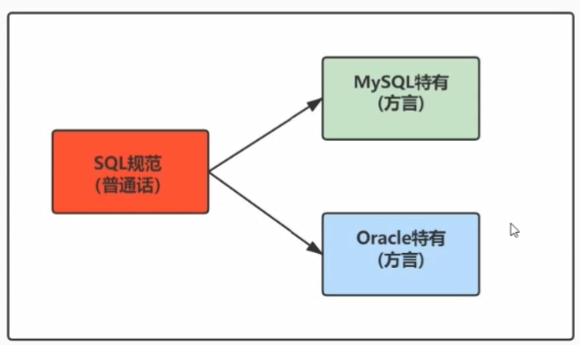
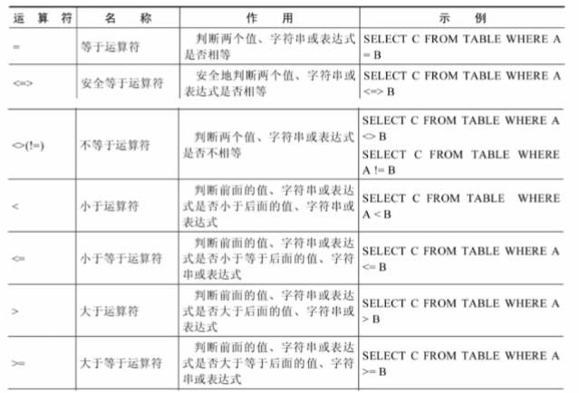
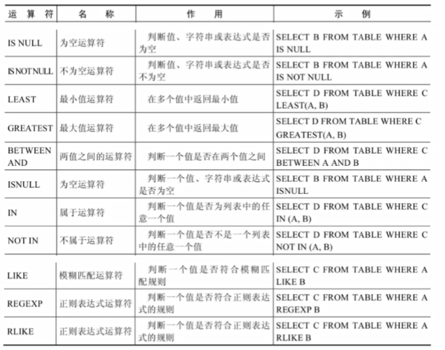
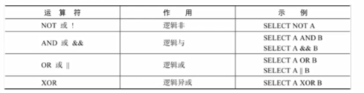
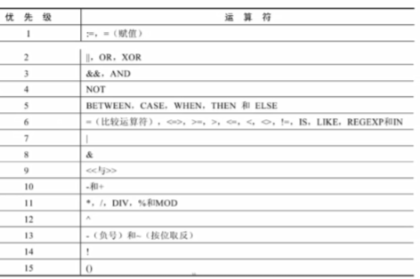
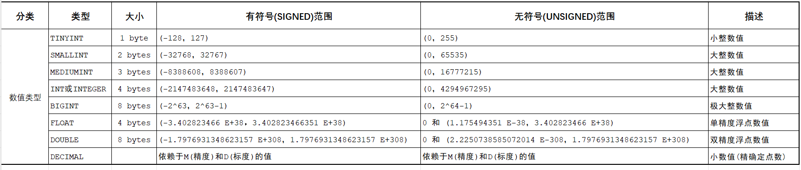
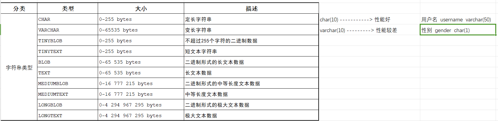
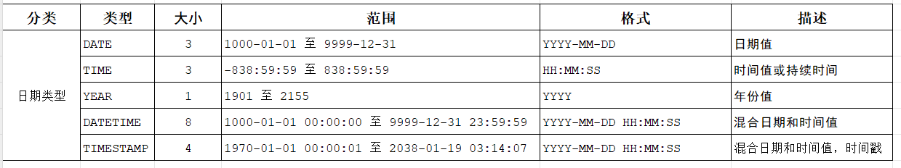
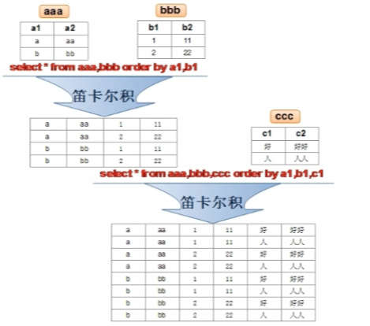
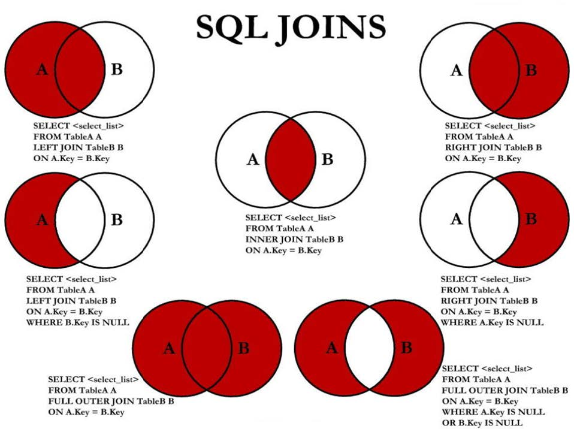

# MySQLLerning

# 一、简介

为什么使用数据库？为了持久化数据，MYSQL是开源的关系型数据库

> E-R(entity-relationship，实体·联系)模型中有三个主要概念是: 实体集、属性、联系集;
>
> 一个实体集(class)对应于数据库中的一个表(table)，一个实体(instance)则对应于数据库表中的一行(row)，也称为一条记录(record)。一个属性(attribute)对应于数据库表中的一列(column)，也称为一个字段(field)。
>
> ORM思想：
>
> ORM思想(object Relational mapping)体现:
>
> - 教据库中的一个表 <---> Java或Python中的一个类;
> - 表中的一条数据 <---> 类中的一个对象(或实体);
> - 表中的一个列 <---> 类中的一个字段、属性(field);

# 二、select 与 运算符

## 1. SQL语言规范

SQL(Structured QueryLanguage，结构化查询语吉)是使用关系模型的教据库应用语言，与数据直接打交道，由IBM 上世纪70年代开发出来。后由美国国家标准局(ANSI)开始着手制定SQL标准，先后有SQL-86，SQL-89，SQL-92，SQL-99等标准

- SQL有两个重要的标准，分别是 SQL92 和 SQL99，它们分别代表了 92 年和 99 年颁布的 SQL 标准，我们今天使用的 SQL语言依然遵循这些标准。



### （1）SQL分类

SQL语言在功能上主要分为如下3大类:

- DDL(Data Definition Languages、数据定义语言)，这些语句定义了不同的数据库、表、视图、索引等数据库对象，还可以用来创建、删除、修改数据库和数据表的结构；

  > 主要的语句关键字包括 CREATE、DROP、ALTER 等.
  >
- DML(Data Manipulation Language、数据操作语言)，用于添加、删除、更新和查询数据库记录，并检查数据完整性；

  > - 主要的语句关键字包括 INSERT、DELETE、UPDATE、SELECT 等;
  > - SELECT 是 SQL 语言的基础，最为重要;
  >
- DCL(Data ControlLanguage、数据控制语言)，用于定义数据库、表、字段、用户的访问权限和安全级别。

  > 主要的语句关键字包括 GRANT、REVOKE、COMMIT、ROLLBACK、SAVEPOINT 等。
  >

因为查询语句使用的非常的频繁，所以很多人把查询语句单拎出来一类: DQL(数据查询语言)。还有单独将 COMMIT、ROLLBACK 取出来称为TCL(Transaction Control Language，事务控制语言)。

### （2）SQL 规则与规范

1. 基本规则 👀️

- SQL 可以写在一行或者多行。为了提高可读性，各子句分行写，必要时使用缩进；
- 每条命令以;或 \g 或 \G 结束；
- 关键字不能被缩写也不能分行；
- 关于标点符号
  - 必须保证所有的()、单引号、双引号是成对结束的；
  - 必须便用英文状态下的半角输入方式；
  - 字符串型和日期时间类型的数据可以使用单引号('')表示；
  - 列的别名，尽量使用双引号("")，而且不建议省略 as ；

2. SQL 大小写规范 👀️

- MySQL 在 Windows 环境下是大小写不敏感的；
- MySQL 在 Linux 环境下是大小写敏感的；
  - 数据库名、表名、表的别名、变量名是严格区分大小写的；
  - 关键字、函数名、列名(或字段名)、列的别名(字段的别名)是忽略大小写的。
- 推荐采用统一的书写规范：
  - 数据库名、表名、表别名、字段名、字段别名等都小写 SQL关键字、函数名、绑定变量等都大写；

3. 注释

可以使用如下格式的注释结构：

```sql
单行注释: # 注释文字(MySQL特有的方式)
单行注释: -- 注释文字(--后面必须包含一个空格。)
多行注释: /* 注释文字 */
```

4. 命名规则
   - 数据库、表名不得超过30个字符，变量名限制为29个；
   - 必须只能包含A-Z a-z 0-9，共63个字符；
   - 数据库名、表名、字段名等对象名中间不要包含空格；
   - 同一个 MySQL 软件中，数据库不能同名;
   - 同一个库中，表不能重名;
   - 同一个表中，字段不能重名必须保证你的字段没有和保留字、数据库系统或常用方法冲突，如果坚持使用，请在SQL句中使用'(着重号)引起来；
   - 保持字段名和类型的一致性，在命名字段并为其指定数据类型的时候一定要保证一致性，假如数据类型在一个表里是整数，那在另一个表里可就别变成字符型了；
5. 数据导入指令

在命令行客户端登录 mySql，使用 source 指令导入

```bash
mysq1> source d:\student.sql
```

## 2. select 与 运算符

### （1）select

```sql
SELECT [feild...]/[*] 
FROM [table_...] 
WHERE [condition_...];
```

- 显示表结构：DESC [表名]；

### （2）算数运算符

1. 加减

在 Java 中，+的左右两边如果有字符串，那么表示字符串的拼接。但是在MySQL中+只表示数值相加，如果遇到非数值类型，先尝试转成数值，如果转失败，就按0计算。(补充:My5QL中字符串拼接要便用字符串函数CONCAT()实现);

```sql
SELECT 1+1, 2+3, 5-2 FROM dual;
SELECT 1+1, 2+3, 5-2;
```

> mysql中的dual表：
>
> - 在 MySQL 和 SQLServer 中可以直接 `se1ect 1`不需要加 from 表名就可以执行, 而在 Oracle 中要满足`select from`的结构: `select 1`不能实现满足上述结构，于是Oracle引入dual虚拟表来满足结构;
> - Oracle 这样表示: select 1 from dual;
> - 在 mysql 里也存在和 oracle 里类似的 dual 虚拟表: 官方声明纯粹是为了满足 `select...from...`C这一习惯问题mysql会忽略对该表的引用;

2. 乘除

```sql
SELECT 1000/1, 100/0;
```

- 一个数乘以整教1和除以整教1后仍得原数;
- 一个数乘以浮点数1和除以浮点数1后变成浮点数，数值与原数相等;
- 一个数除以整数后，不管是否能除尽，结果都为一个浮点数; 👀️
- 一个数除以另一个数，除不尽时，结果为一个浮点数，并保留到小数点后4位；👀️
- 乘法和除法的优先级相同，进行先乘后除操作与先除后乘操作，得出的结果相同,在数学运算中，0 不能用作除数，在 MySQL 中，一个数除以 0 为 NULL；

3. 求模（取余）运算符

```sql
SELECT 1000 % 3, 100 % 5;
SELECT 4 DIV 2, 6 MOD 5;
```

### （3）比较运算符

1. 符号类

```sql
SELECT 100=50*2, 100=null, null=null, 100<=>null, null<=>null;
-- 1,null,null,0,1
```

> 比较运算符用来对表达式左边的操作数和右边的操作数进行比较，比较的结果为真则返回1，比较的结果为假则返回0，其他情况则返回NULL。
> 比较运算符经常被用来作为SELECT查询语句的条件来便用，返回符合条件的结果记录。



> 安全等于运算符(<=>)与等于运算符(=)的作用是相似的，唯一的区别是'<=>'可以用来对NULL进行判断。在两个操作数均为 NULL 时，其返回值为 1，而不为NULL;当一个操作数为NULL时，其返回值为 0，而不为NULL.

2. 非符号类

```sql
SELECT 50 BETWEEN 10 AND 100;
```



### （4）逻辑运算符

```sql
SELECT !(1=1), NOT (1=1) AND (2=1), (1=1) OR (1=2), 2 OR 5;
```

MySQL中支持4种逻辑运算符如下: 逻辑运算符主要用来判断表达式的真假，在MYSQL中，逻辑运算的返回结果为1、0或者NULL。



- 运算符优先级：



数字编号越大，优先级越高，优先级高的运算符先进行计算，可以看到，赋值运算的优先级最低，使用“()“括起来的表达式的优先级别最高。

# 三、DML与数据类型

## 1. 添加语句

```sql
INSERT INTO departments (id, name) VALUES (001, '陈越');
INSERT INTO departments VALUES (002, '陈维', 2, 002, CURRENT_TIME), (003, '陈清', 2, 003, CURRENT_TIME);
-- 插入子查询结果: 查询结果列应与插入列对应
INSERT INTO departments (id, name, count) SELECT 004, name, count FROM departments where id=001;

```

## 2. 更新删除语句

```sql
UPDATE departments SET count=10 WHERE name LIKE '陈%'; -- 更新/逻辑删除
DELETE FROM departments WHERE name='陈越'; -- 物理删除
```

### ❤️ MYSQL 8.0 新特新：计算列

> 什么叫计算列呢? 简单来说就是某一列的值是通过别的列计算得来的。例如，a列值为1、b列值为2，c列不需要手动插入，定义a+b的结果为c的值，那么c就是计算列，是通过别的列计算得来的。

在 MySQL 8.0 中，CREATE TABLE 和 ALTER TABLE 中都支持添加计算列

```sql
CREATE TABLE tab1(
    id INT,
    a INT,
    b INT,
    c INT GENERATED ALWAYS AS (a + b) VIRTUAL
);
```

## 3. 数据类型







MYSQL支持JSON格式数据，存数为JSON格式字符串

```sql
ALTER TABLE tab1 ADD js JSON;
```

> MySQL空间类型扩展支持地理特征的生成、存储和分析。这里的地理特征表示世界上具有位置的任何东西，可以是一个实体，例如一座山;可以是空间，例如一座办公楼; 也可以是一个可定义的位置，例如一个十字路口等等。MySQL中使用Geometny(几何)来表示所有地理特征。Geometry指一个点或点的集合，代表世界上任何具有位置的事物。
>
> MySQL的空间数据类型(Spatial DataType)对应于OpenGIs类，包括单值类型: GEOMETRY、POINT、LINESTRING、POLYGON以及集合类型:MULTIPOINT、MULTILINESTRING、MULTIPOLYGON.GEOMETRYCOLLECTION.

# 四、排序、分页和多表查询

## 1. 排序

> MYSQL 默认的排序规则是按照添加顺序

使用 ORDER BY 子句排序

- ASC（ascend）：升序；（默认）
- DESC(descend）：降序；

ORDER BY 子句在 SELECT 语句的结尾；

```sql
SELECT * FROM student WHERE CHAR_LENGTH(name)=3 ORDER BY age DESC;
SELECT * FROM student ORDER BY age DESC, height ASC; -- 多列排序

SELECT * FROM student ORDER BY weight; -- weight列数据类型是varchar，会按照ASCII码值排序，所以如果要按照数值排序需要 weight+0
SELECT * FROM student ORDER BY weight+0;
```

## 2. 分页

> 所谓分页显示，就是将数据库中的结果集，一段一段显示出来需要的条件。格式：`LIMIT [位置偏移量，]行数`

第一个"位置偏移是"参数指示MySQL从哪一行开始显示，是一个可选参数，如果不指定“位置偏移量”，将会从表中的第一条记录开始(第一条记录的位置偏移量是0，第二条记录的位置偏移量是1，以此类推)第二个参数”行数”指示返回的记录条数。

分页显示公式：

```sql
-- SELECT * FROM table LIMIT (PageNow - 1)*Pagesize, PageSize;
SELECT * FROM student LIMIT 5, 5;
SELECT * FROM student LIMIT 10, 5;
```

## 3. 笛卡尔积

表与表之间的关系：

- 一对一
- 一对多
- 多对多
- 自我引用

```sql
-- 案例
-- 创建class表
CREATE TABLE class(class_id int , name VARCHAR(20));
desc class;

-- 表中添加数据
INSERT INTO class VALUES(1,'三年一班'),(2,'三年二班');

SELECT * from class;

-- 学生表添加教室id字段
ALTER TABLE student ADD class_id VARCHAR(20);

SELECT * FROM student;
-- 更新学生的教室id
UPDATE student SET class_id = '1' WHERE `id` IN (1, 2, 3, 4, 5,6,7,8,9,10);
UPDATE student SET class_id = '2' WHERE `id` IN (11, 12, 13,14,15,16,17);
-- student 已经和班级表进行关联
-- 学生-> 班级 一对一的关系
-- 班级 -> 学生  一对多的关系
```

```sql
-- 要求student表通过班级ID匹配班级名称：查询姓名和所在班级名称
-- 联表查询，既要查学生表，又要查班级表
SELECT student.name AS studentName, class.name AS className FROM student, class;

-- 查询两个表中相同字段会报错
SELECT name FROM student, class;

-- 正确写法
SELECT student.name, class.name FROM student, class;
SELECT student.name, class.name FROM student CROSS JOIN class;
SELECT student.name, class.name FROM student INNER JOIN class;
SELECT student.name, class.name FROM student JOIN class;

```

### ❤️ 笛卡尔积

数学上，有两个集合 A = (a,b)，B = (1,2,3)，则两个集合的笛卡尔积 = {(a,1}),{a,2},{a,3),(b,1),{b,2},(b,3)} 列出所有情况，一共是 2*3 = 6条记录;



SQL92中，笛卡尔积也称为**交叉连接**，英文是CROSSJOIN。在SQL99 中也是使用 CROSS JOIN 表示交叉连接。它的作用就是可以把任意表进行连接，即便这两张表不相关。在 MYSQL 中如下情况会出现笛卡尔积:

#### 👍 笛卡尔积错误产生条件：

- 省略多个表的连接条件(或关联条件)
- 连接条件(或关联条件)无效
- 所有表中的所有行互相连接

为了避免笛卡尔积，可以在 WHERE 加入有效的连接条件：

```sql
SELECT s.name, c.name FROM student AS s JOIN class AS c WHERE s.class_id=c.class_id; -- 加上连接条件
```

## 4. 多表查询

### （1）等值连接 vs 非等值连接

#### 等值连接

```sql
-- 等值连接
SELECT s.name, c.name FROM student AS s, class AS c WHERE s.class_id=c.class_id;
```

- 多个连接条件与 AND 操作符
- 区分重复的列名
  - 多个表中有相同列时，必须在列名之前加上表名前缀
  - 在不同表中具有相同列名的列可以用表名加以区分

#### 非等值连接

```sql
-- 非等值连接
SELECT s.name, c.name FROM student AS s JOIN class AS c WHERE s.age BETWEEN c.class_id * 20 AND c.class_id * 40;
```

### （2）自连接 vs 非自连接

当 table1 和 table2 本质上是同一张表，只是用取别名的方式虚拟成两张表以代表不同的意义。然后两个表再进行内连接，外连按等查询。通过 concat 函数返回固定格式：

```sql
-- 自连接
SELECT s1.name, s2.name FROM student AS s1 INNER JOIN student AS s2 WHERE s1.age = s2.gender;
```

### （3）内连接 vs 外连接

- 内连接: 合并具有同一列的两个以上的表的行, 结果集中不包含一个表与另一个表不匹配的行
- 外连接: 两个表在连接过程中除了返回满足连接条件的行以外还返回左(或右)表中不满足条件的行 ，这种连接称为左(或右)外连接。没有匹配的行时,结果表中相应的列为空(NULL)。

  - 如果是左外连接，则连接条件中左边的表也称为主表，右边的表称为从表；（**左表全部，右表可NULL**）👀️
  - 如果是右外连接，则连接条件中右边的表也称为主表，左边的表称为从表；（**右表全部，左表可NULL**）👀️
- 在 SQL92 中采用(+)代表从表所在的位置。即左或右外连接中，(+)表示哪个是从表，Oracle 对 SQL92 支持较好，而 MySQL 则不支持 SQL92 的外连接;
- 而且在 SQL92 中，只有左外连接和右外连接，没有满(或全)外连;

### 

### SQL99语法实现多表查询

使用 `JOIN..ON` 子句创建连接的语法结构:

```sql
 SELECT table1.column, table2.column,table3.column
 FROM table1
 JOIN table2 ON table1 和 table2 的连接条件
 JOIN table3 ON table2 和 table3 的连接条件
```

它的嵌套逻辑类似我们使用的 FOR 循环：

```sql
for t1 in table1:
for t2 in table2:
if condition1:
for t3 in table3:
if condition2:
output t1 + t2 + t3
```

> SQL 99 采用的这种嵌套结构非常清爽、层次性更强、可读性更强，即使再多的表进行连接也都清晰; 可见。如果你采用 SQL92，可读性就会大打折扣。

❤️ ON 不可以进行非等值连接


### （4）满外连接 MYSQL不支持

满外连接的结果=左右表匹配的数据+左表没有匹配到的数据+右表没有匹配到的数据；

> ❤️ SQL99是支持满外连接的。使用FULL JOIN 或 FULL OUTER JOIN 来实现: 需要注意的是，MYSQL不支持 FULL JOIN，但是可以用 LEFT JOIN UNION RIGHT JOIN代替；

### (5) UNION 的使用

合井查询结果 利用 UNION 关键字，可以给出多条 SELECT 句，并将它们的结果组合成单个结果集。合并时，两个表对应的列教和数据类型必须相同，并且相互对应，各个 SELECT 语句之间使用 UNION 或 UNION ALL关键字分隔。


```sql
SELECT column.... FROM table1 
UNION [ALL]
SELECT column.... FRom table2
```

- UNION 操作符返回两个查询的结果集的并集，去除重复记录；❤️
- UNION ALL 操作符返回两个查询的结果集的并集，对于两个结果集的重复部分，不去重；❤️

> 注意: 执行 UNION ALL 语句时所需要的资源比 UNION 语句少。如果明确知道合并数据后的结果数据不存在重复数据，或者不需要去除重复的数据，则尽是使用 UNION ALL语句，以提高数据查询的效率。

### （6）7 种 SQL JOIN 的实现




#### 👍SQL99 语法新特性

1. NATURAL JOIN 自然连接

SQL99 在 SQL92 的基础上摄供了一些特殊语法，比如 NATURAL JOIN 用来表示自然连接。我们可以把自然连接理解为 SQL92 中的等值连接。它会帮你自动查询两张连接表中所有相同的字段，然后进行等值连接。

在SQL92标准中：

```sql
SELECT a.name, b.name AS className 
FROM student a join class b 
on a.class_id = b.class_id;
```

在 SQL99 中你可以写成：

```sql
SELECT a.name, b.name AS className 
FROM student a NATURAL JOIN class b;
```

Natural Join 特征:

- 关联的表具有一对或多对同名的列
- 连接时候不需要使用 on 或者 using 关键字

2. USING 连接

当我们进行连接的时候，SQL99 还支持使用 USING 指定数据表里的同名字段进行等值连接。但是只能配合JOIN一起使用。比如:

```sql
SELECT a.name, b.name AS className 
FROM student a join class b 
USING (class_id);
```

你能看出与自然连接 NATURAL JOIN 不同的是，USING 指定了具体的相同的字段名称，你需要在 USING的括号 () 中填入要指定的同名字段。同时使用<font color="#FF8C00"> JOIN...USING</font> 可以简化 JOIN ON 的等值连接。它与下面的 SQL 查询结果是相同的：

```sql
SELECT a.name, b.name AS className 
FROM student a join class b 
where a.class_id= b.class_id;
```


---

<font color="##660000">**注意：**</font>

我们要<font color="#FF8C00">控制连接表的数量</font>。多表连接就相当于嵌套 for 循环一样，非常消耗资源，会让 SQL 查询性能下
降得很严重，因此不要连接不必要的表。在许多 DBMS 中，也都会有最大连接表的限制。

> 【<font color="#FF8C00">强制</font>】超过三个表禁止 join。需要 join 的字段，数据类型保持绝对一致；多表关联查询时， 保证被关联的字段需要有索引。
>
> 说明：即使双表 join 也要注意表索引、SQL 性能。
>
> 来源：阿里巴巴《Java开发手册》


**附录：常用的 SQL 标准有哪些**

在正式开始讲连接表的种类时，我们首先需要知道 SQL 存在不同版本的标准规范，因为不同规范下的表连接操作是有区别的。

SQL 有两个主要的标准，分别是 <font color="#FF8C00">SQL92</font> 和 <font color="#FF8C00">SQL99</font> 。92 和 99 代表了标准提出的时间，SQL92 就是 92 年提出的标准规范。当然除了 SQL92 和 SQL99 以外，还存在 SQL-86、SQL-89、SQL:2003、SQL:2008、SQL:2011 和 SQL:2016 等其他的标准。

这么多标准，到底该学习哪个呢？**实际上最重要的 SQL 标准就是 SQL92 和 SQL99**。一般来说 SQL92 的形式更简单，但是写的 SQL 语句会比较长，可读性较差。而 SQL99 相比于 SQL92 来说，语法更加复杂，但可读性更强。我们从这两个标准发布的页数也能看出，SQL92 的标准有 500 页，而 SQL99 标准超过了1000 页。实际上从 SQL99 之后，很少有人能掌握所有内容，因为确实太多了。就好比我们使用Windows、Linux 和 Office 的时候，很少有人能掌握全部内容一样。我们只需要掌握一些核心的功能，满足日常工作的需求即可。

**SQL92 和 SQL99 是经典的 SQL 标准，也分别叫做 SQL-2 和 SQL-3 标准**。也正是在这两个标准发布之后，SQL 影响力越来越大，甚至超越了数据库领域。现如今 SQL 已经不仅仅是数据库领域的主流语言，还是信息领域中信息处理的主流语言。在图形检索、图像检索以及语音检索中都能看到 SQL 语言的使用。
